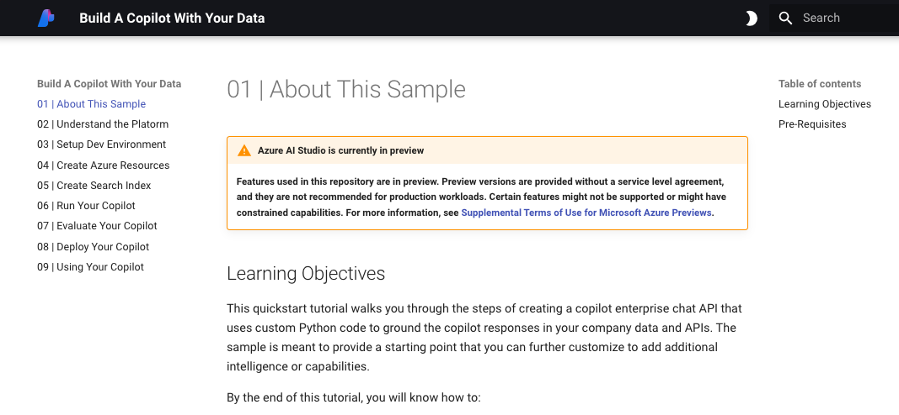

# Azure AI Studio: Python Quickstart Sample 

> [!WARNING]  
> **Features used in this repository are in preview. Preview versions are provided without a service level agreement, and they are not recommended for production workloads. Certain features might not be supported or might have constrained capabilities. For more information, see [Supplemental Terms of Use for Microsoft Azure Previews](https://azure.microsoft.com/en-us/support/legal/preview-supplemental-terms/).**

## Table Of Contents

1. [About: Azure AI Studio (preview)](#1-about-azure-ai-studio-preview) 
1. [Using: Azure AI SDK (Python)](#2-using-azure-ai-sdk-python)
1. [Quickstart: Build a copilot](#3-quickstart-build-a-copilot)
1. [Tutorial: Preview in browser](#4-tutorial-preview-in-browser)
1. [Resources: Keep Learning](#5-resources-keep-learning)
1. [Contributing](#6-contributing)  
1. [Trademarks](#7-trademarks)  

## 1. About: Azure AI Studio (preview)

This repository contains a copilot getting sample that can be used with the the [Azure AI Studio (preview)](https://learn.microsoft.com/azure/ai-studio). Explore these resources to learn more about the tools and services we'll use today.

* [Azure AI SDK](https://learn.microsoft.com/azure/ai-studio/how-to/sdk-install) - access Azure AI Studio resources and generative-ai tools and services,  programmatically from Python code.
* [Azure AI CLI](https://learn.microsoft.com/azure/ai-studio/how-to/cli-install) -  get cross-platform, language-agnostic access to Azure AI Studio resources, tools and services, from the commandline.
* [Azure AI services](https://learn.microsoft.com/azure/ai-services/what-are-ai-services) - access a wide range of pre-built and customizable APIs and models, to help build your generative AI apps.

## 2. Using: Azure AI SDK (Python) 

The sample walks you through creating a copilot enterprise chat API that uses custom Python code to ground the copilot responses in your company data and APIs. The sample is meant to provide a starting point that you can further customize to add additional intelligence or capabilities. 

By following our [**step-by-step tutorial**](docs/start.md) you will be able to: 
 - set up your development environment (pre-built & manual options).
 - create your Azure AI resources and project.
 - build an index containing product information. 
 - run your co-pilot, and validate it with a sample question.
 - evaluate it, and deploy it on Azure.
 - invoke the deployed API (endpoint).

In the process, you will get familiar with the features and usage of Azure AI CLI (commandline utility) and Azure AI SDK (Python library) in completing various tasks required in this end-to-end development workflow.

> [!NOTE]  
> We do not guarantee the quality of responses produced by this sample copilot or its suitability for use in your scenario. Copilot responses will vary as this sample remains under active development. You **must perform your own validation** of the copilot responses to evaluate its suitability for use within your company or application requirements.

## 3. Quickstart: Build a copilot

Ready to get started building the copilot with custom data? 

1. [**Fork this sample**](https://github.com/Azure-Samples/aistudio-python-quickstart-sample/fork) to your own profile on Github. This will give you the flexibility to change the codebase and experiment with your own data later.
1. [**Open the step-by-step tutorial**](docs/start.md) in your fork. Follow instructions to setup your develpment environment, then keep going.


## 4. Tutorial: Preview in browser

This repository is instrumented with a [mkdocs.yml](mkdocs.yml), allowing you to preview the step-by-step guide in your browser. This requires two steps.

1. Install the required package - ```pip install mkdocs-material```
1. Run the preview server - ```mkdocs serve```

Launch the browser to the URL provided by the preview server. You should see a page similar to the one below. This can provide a better navigation experience and has built-in support for searching the tutorial and toggling light/dark modes.




## 5. Resources: Keep Learning

This sample is part of the larger [Azure AI Samples](https://github.com/azure-samples/azureai-samples) collection. Want to build the copilot using a different technology stack? Here's a list of the _standalone_ quickstart samples currently available for Azure AI Studio.

| Copilot Sample | Technology Focus|
|--------|-------------|
| [Python Quickstart](https://github.com/Azure-Samples/aistudio-python-quickstart-sample) |[Azure AI SDK For Python](https://learn.microsoft.com/python/api/overview/azure/ai?view=azure-python-preview) (preview) |
| [Semantic Kernel Quickstart](https://github.com/Azure-Samples/aistudio-python-semantickernel-sample) |  [Semantic Kernel](https://learn.microsoft.com/semantic-kernel/overview/)  |
| [PromptFlow Quickstart](https://github.com/Azure-Samples/aistudio-python-promptflow-sample) | [Prompt flow](https://microsoft.github.io/promptflow/index.html)  |
| [Langchain Quickstart](https://github.com/Azure-Samples/aistudio-python-langchain-sample)| [Langchain](https://www.langchain.com/)  |
| | |

Want to learn more about Azure AI Studio, explore more advanced samples (for end-to-end development) or complete a learning path? Bookmark [this learning collection](https://aka.ms/ai-studio/collection) and explore the resources to continue your learning journey.


## Contributing

This project welcomes contributions and suggestions.  Most contributions require you to agree to a
Contributor License Agreement (CLA) declaring that you have the right to, and actually do, grant us
the rights to use your contribution. For details, visit https://cla.opensource.microsoft.com.

When you submit a pull request, a CLA bot will automatically determine whether you need to provide
a CLA and decorate the PR appropriately (e.g., status check, comment). Simply follow the instructions
provided by the bot. You will only need to do this once across all repos using our CLA.

This project has adopted the [Microsoft Open Source Code of Conduct](https://opensource.microsoft.com/codeofconduct/).
For more information see the [Code of Conduct FAQ](https://opensource.microsoft.com/codeofconduct/faq/) or
contact [opencode@microsoft.com](mailto:opencode@microsoft.com) with any additional questions or comments.


## Trademarks

This project may contain trademarks or logos for projects, products, or services. Authorized use of Microsoft 
trademarks or logos is subject to and must follow 
[Microsoft's Trademark & Brand Guidelines](https://www.microsoft.com/en-us/legal/intellectualproperty/trademarks/usage/general).
Use of Microsoft trademarks or logos in modified versions of this project must not cause confusion or imply Microsoft sponsorship.
Any use of third-party trademarks or logos are subject to those third-party's policies.

