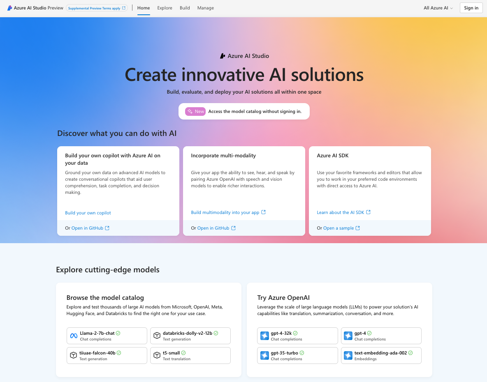
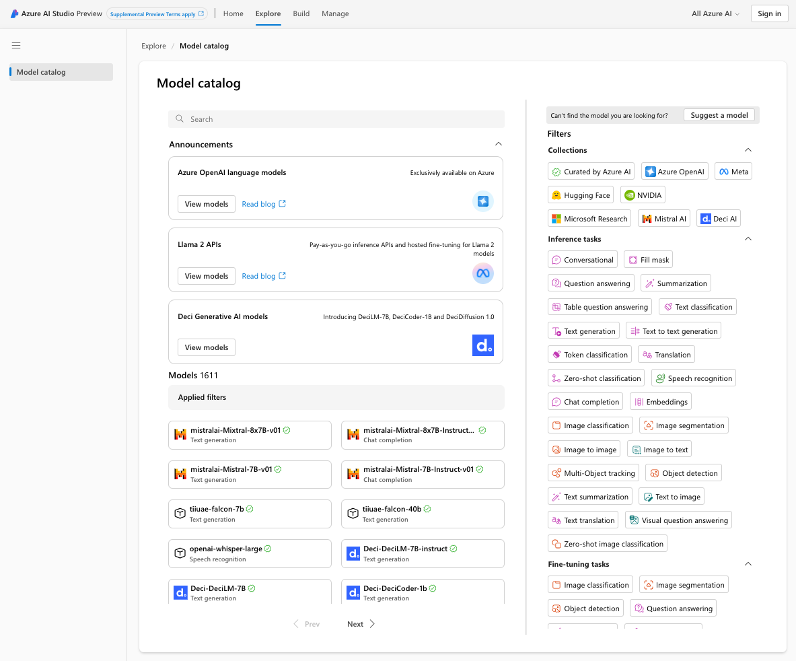

# 02 | Understand Key Concepts

This sample is focused on the Azure AI Studio (preview) platform and the related Azure AI SDK (for Python) and Azure AI CLI (for cross-platform use). **If you're already familiar with the platform, skip ahead to the next step.** If you're new to this platform, read on for a quick overview of key terms and concepts relevant to this sample.

## 2.1 | What is Azure AI Studio?

[Azure AI Studio](https://aka.ms/azureaistudio) is a unified platform for streamlining your end-to-end development workflow for generative AI solutions. It consists of:

 - Azure AI Studio UI - a web-based interface suitable for low-code developers who want to build and manage their AI projects.
 - Azure AI SDK - providing Python libraries to manage your AI resources and generative AI workflows for a _code-first_ approach.
 - Azure AI CLI - a language-agnostic cross-platform utility for interacting with the Azure AI platform from the commandline.

Visit [https://ai.azure.com](https://ai.azure.com) to explore the Azure AI Studio capabilities using the web UI. 

Use the platform in guest mode to explore available models from OpenAI, Meta, Hugging Face, Microsoft Research etc., as shown below.

Then log in with a valid Azure account to use the platform capabilities, from model deployment to end-to-end application development. Azure AI Studio lets you build AI projects and manage your AI resources in one place, and provides rich tools and guidance for streamlining the end-to-end development lifecycle from prompt engineering to LLM Ops.

## 2.1 | What is a copilot?

A copilot is an application that uses modern AI and large language models (LLM) to assist you in completing complex cognitive tasks _using your own data_ for improved responses.

In this particular tutorial, we are building a copilot that assists you in answering user questions _about your company data_, by using the [Retrieval Augmented Generation (RAG)](https://learn.microsoft.com/azure/ai-studio/concepts/retrieval-augmented-generation) pattern  with your preferred LLM deployment endpoint.

## 2.3 | What does RAG mean?
[Retrieval Augmented Generation (RAG)](https://learn.microsoft.com/azure/search/retrieval-augmented-generation-overview) is a pattern where you _augment_ the capability of the default Large Language Model (LLM) by adding an _information retrieval system_. This provides you more control over the data used by the LLM in generating responses to user "questions", allowing you to tailor copilot responses to reflect your company data and requirements.

The RAG pattern (shown above) maintains a data store with your custom data. When the copilot receives a user question, it retrieves data matching the question from this store. It then combines the user question with retrieved data to form the prompt sent to the LLM, helping ground the returned responses.

Searching and retrieving data quickly and accurately is critical. The RAG pattern achieves this by proactively maintaining _search indexes_ (as shown above) to improve performance and accuracy.

Azure AI provides an Index asset to use with RAG - where the asset knows where the index is stored, how to access it, what search modes it supports, whether it has vector search capability, what embedding model it uses for this, and more. Currently, Azure AI Search is the primary Index solution for Azure AI projects. | See: [Retrieval Augmented Generation and Indexes](https://learn.microsoft.com/en-us/azure/ai-studio/concepts/retrieval-augmented-generation#how-does-rag-work)

## 2.4 | What is Azure AI Search? 

[Azure AI Search](https://learn.microsoft.com/azure/search/search-what-is-azure-search) (formerly called _Azure Cognitive Search_) provides tools, APIs and infrastructure to **support information retrieval at scale** over heterogeneous data sources - for traditional and conversational search solutions. It is a [proven solution for information retrieval in RAG architectures](https://github.com/Azure-Samples/azure-search-openai-demo) and can be accessed from Azure AI Studio, Azure AI SDK or Azure AI CLI.

## 2.5 | What is Vector Search?

Vector search is an information retrieval approach using numeric representations of content for search scenarios. The search engine now matches on vectors that are the most similar to the query, without needing to match exact terms. This helps it power similarity search, multi-modal search, recommendation engines, and apps using
[Retrieval Augmented Generation (RAG)](https://learn.microsoft.com/azure/search/retrieval-augmented-generation-overview).

[Vector search in Azure AI Search](https://learn.microsoft.com/en-us/azure/search/vector-search-overview) is available by default, and functions as shown in the figure. We use Azure AI Search in this sample to create a vector store for the product catalog data. We then use the Azure Open AI `text-embedding-ada-002` model to generate numeric representations for more efficient search indexing and retrieval. 

## 2.6 | Learning Resources

This was a quick overview of key terms and concepts. Explore [this collection](https://aka.ms/ai-studio/collection) for links to more detailed documentation and training resources.

---

[**Next Step**](./03-setup.md) | Setup Dev Environment
