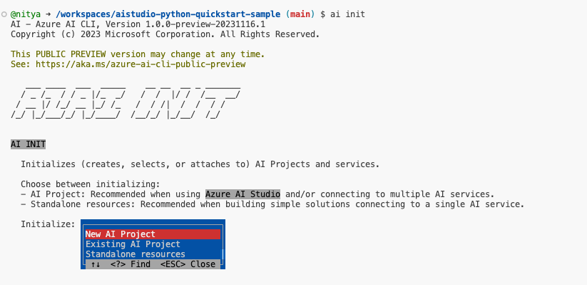
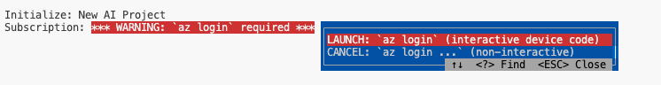
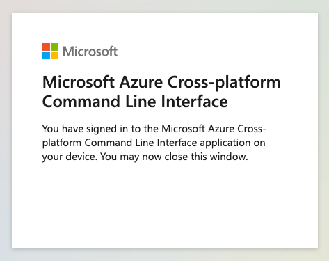
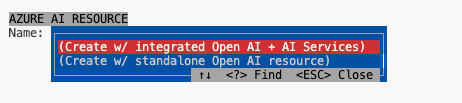
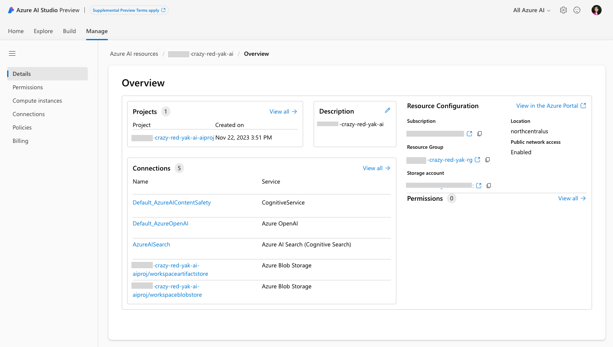

# 04 | Create Azure Resources

## Step 2: Create and connect to Azure Resources

> [!NOTE]  
> Unless specified explicitly, all screenshots shown were taken in a GitHub Codespaces environment. They are meant for guidance only and may not be representative of the latest versions of the Azure AI SDK or CLI.


1. Run the following command.

    ```
    ai init
    ```

    You should see an interactive wizard that walks you through the process of creating an Azure AI project and provisioning the required Azure AI resources.
    


2. If you are not already logged into your Azure account, you will be prompted to do so at this time. Choose the interactive option.

    

   You will be given a code to enter in a browser to complete the authentication flow. If successful, you should see this message. Return to the terminal to continue the init process. 
    
    

3. Next, you will be prompted to create the Azure AI Resources for the project you are setting up, including the region and OpenAI model deployments for chat (`gpt-35-turbo-16k-0613`) and embeddings (`text-embedding-ada-002-2`).

    

4. Next, you will be prompted to create the Azure AI Search resource - I opted to have this be created in the same region as the other resources, and associated with the same resource group for convenience. You should now see a `config.json` file created with the following properties, with values set by your project.

    ```json
    {
        "subscription_id": "your_subscription_id",
        "resource_group": "your_resource_group",
        "project_name": "your_project_name"
    }
    ```

5. Your Azure AI Project is ready. Visit [Azure AI Studio](https://ai.azure.com) and look under the `Manage` tab for the Azure AI resource created. Click to see details as shown below - including a handy link to the Azure Portal for additional actions and information.

    

## Next Steps

🟩 Congratulations! Our Azure AI project is ready. Now, it's time to build the Azure AI Search index for our product data, and use it for Retrieval Augmented Generation in our copilot.

➡️ [**Step 03**: Build the Azure AI Search Index](./step-03.md)

