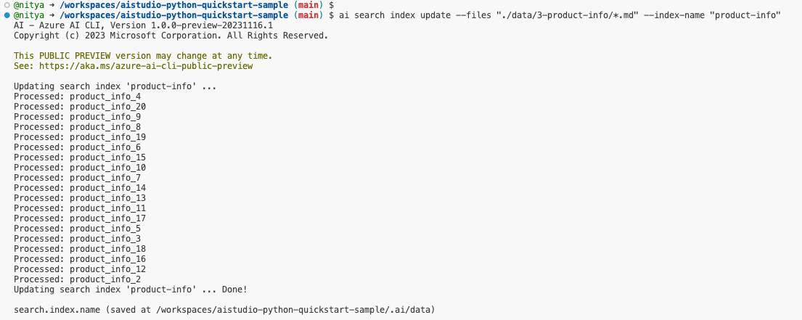
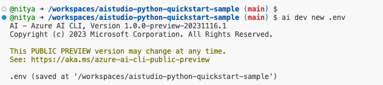

# 05 | Create Search Index

## Step 3: Build an Azure Search index

In this step, we'll use the Azure AI CLI to build an Azure Search index for our product data. This index will then be used by our copilot to retrieve relevant information and create an augmented prompt that can be used by the targeted LLM to generate a more relevant response to the user question.

> [!NOTE]  
> For our tutorial, we'll use the sample data in the `./data/3-product-info/` folder. This currently has a catalog of items in categories like "Tents", "Sleeping Bags", "Hiking Footwear", "Hiking Clothing", "Backpacks", and "Camping Tables". However, we encourage you to try the same steps with your own data next.


1. First, we'll create the Azure AI Search index for our custom product data and give it an index-name:
    ```
    ai search index update --files "./data/3-product-info/*.md" --index-name "product-info"
    ```
    On successful completion of this step, your terminal output should show something like this:
    

2. Next, use the Azure AI CLI to generate the `.env` file with required environment variables using the following command.

    ```
    ai dev new .env
    ```
    On successful completion of this step, your terminal output should show something like this:
    

    The `.env.sample` file shows the list of environment variables that need to be configured by this process. These variables are then used by the Azure AI SDK and Azure AI CLI, for configuring clients to interact with the copilot implementation and Azure AI resources.

## Next Steps

🟩 Congratulations!! 

You now have an Azure AI project with an Azure AI Search index using your custom data, and a copilot that can use Retrieval Augmented Generation to generate a more relevant response to user questions.

Now, it's time to test our copilot with a sample question that relates to the custom data we used for building the index.

➡️ [**Step 04**: Validate the copilot with a sample question](./step-04.md)