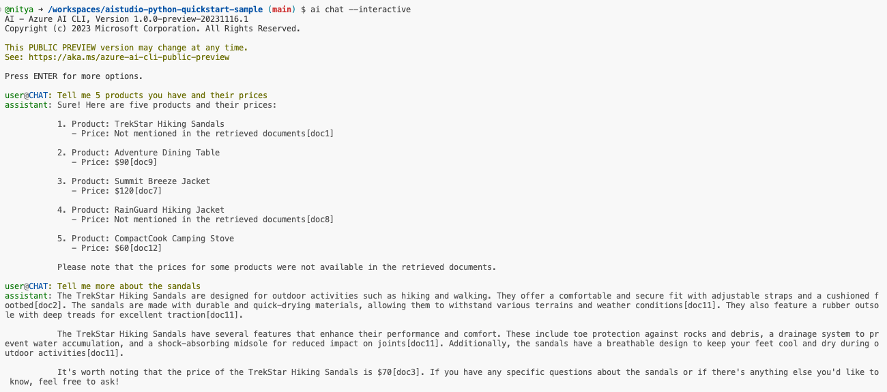
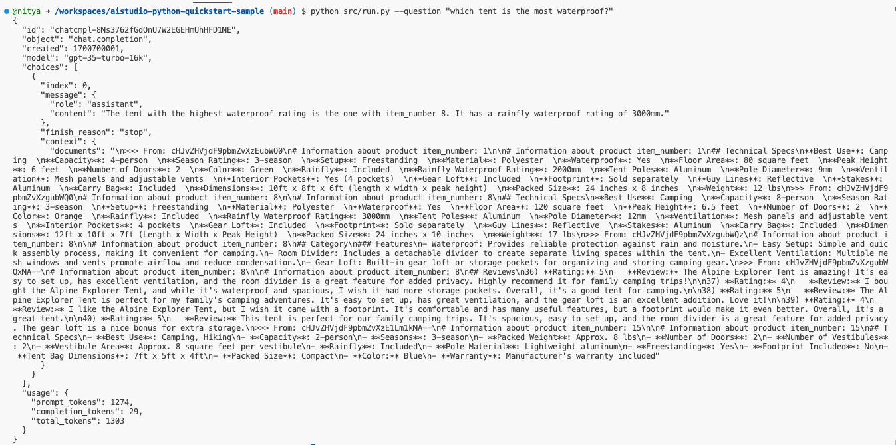
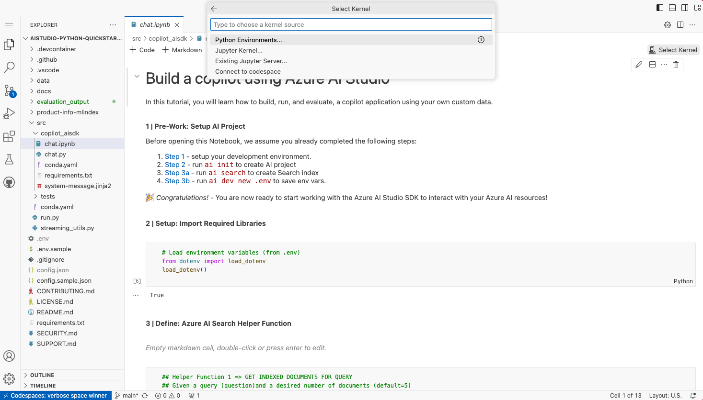
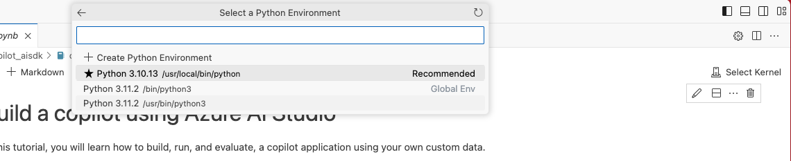
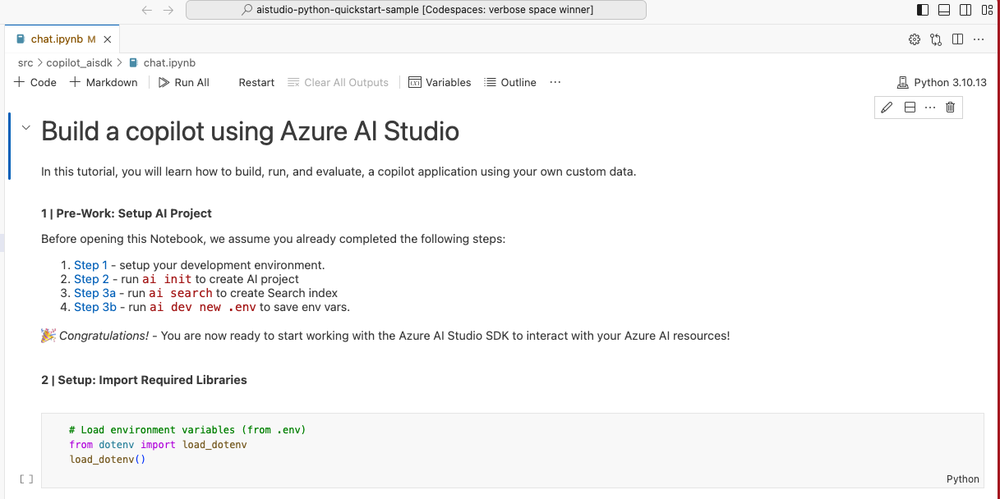
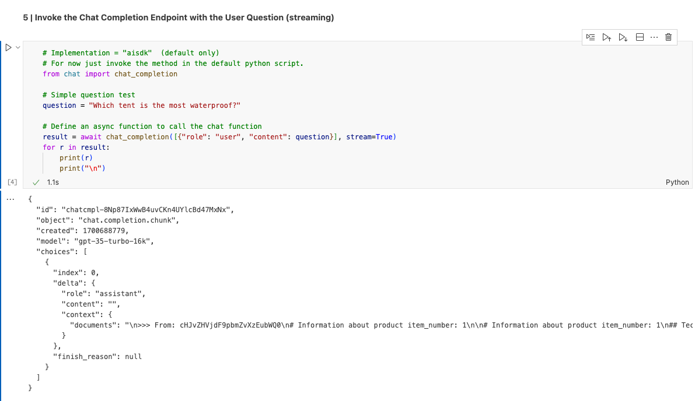
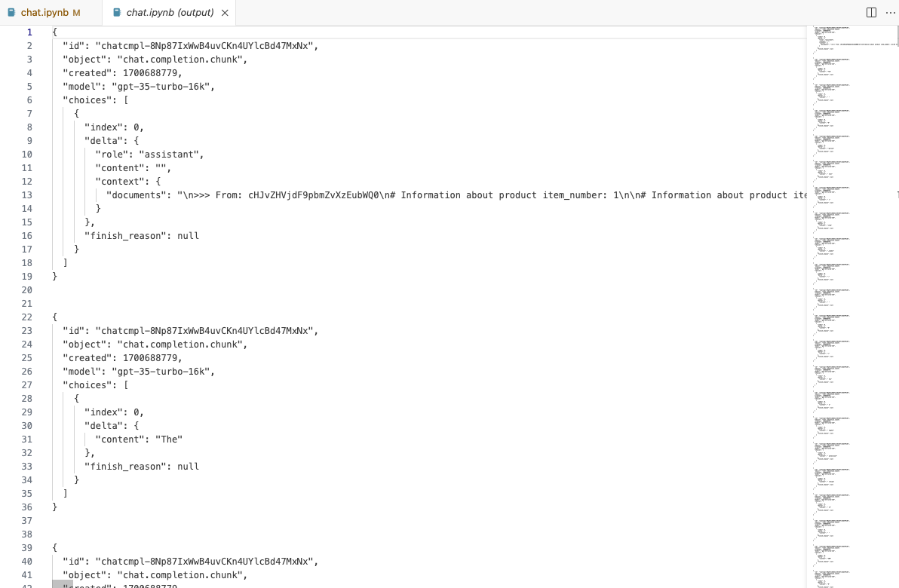
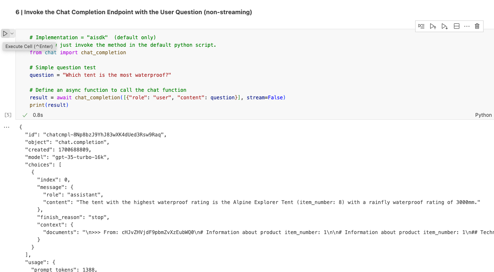

# 06 | Run Your Copilot

## Step 4: Run the co-pilot with a sample question

> [!NOTE]  
> You can interact with the copilot using the Azure AI CLI (from commandline) or the Azure AI SDK (from Python code or Jupyter notebooks). Let's explore all three.


### 1. Using Azure AI CLI

The Azure AI CLI has an `ai chat` command that allows you to interact with the copilot. Once you have initialized resources and have a deployment, use `ai chat` to engage interactively or non-interactively with the copilot. 

You can _chat with your data_ or _chat with a function_ for more grounded or custom chat experiences. Use `ai chat help` to see available options or browse [the documentation](https://learn.microsoft.com/azure/ai-studio/how-to/cli-install#ai-chat) for details. 

Let's look at some examples.


1. Example of a non-interactive chat. We'll use the `--user` option to ask the copilot a simple question.

    ```bash
    ai chat --user "What products do you have? Give me name, price and 1 sentence descriptions for each"
    ```

    

1. Example of interactive chat. This sets up a conversation with the copilot that maintains context. Use `exit` to exit the chat.

    ```bash
    ai chat --interactive
    ```
    

3. Example of a "chat with function" capability. This allows us to define and use a tailored function to interact with the copilot.

    ```bash
    ai chat --interactive --function src/copilot_aisdk/chat:chat_completion
    ```
    


### 2. Using Azure AI SDK - Python Code

The `src/copilot_aisdk/chat.py` defines two functions using the Azure AI SDK, that effectively represent our copilot 'with custom data' implementation.
 - `get_documents` generates a vector embedding of the user question, then uses the Azure AI Search client to retrieve documents relevant to it.
 - `chat_completion` uses the Azure OpenAI chat deployment endpoint with the document-enhanced question, to get a more relevant res

The `src/run.py` file provides two capabilities:
 - It uses the Azure AI SDK to interact with Azure AI services (to create and manage resources) and with our copilot implementation (to ask user questions)
 - It has a `main` function that can be used to invoke these functions based on commandline arguments. Use `src/run.py --help` to see available options.

Let's ask our copilot a simple question using the `--question` option this provides, as follows:

```bash
python src/run.py --question "which tent is the most waterproof?"
```



Try adding a `--stream` option and see what happens.

(_Hint: it will return a collection of objects, each with part of the response - allowing you to render that in chunks to simulate a more interactive chat experience for users._)


### 3. Using Azure AI SDK - Jupyter Notebook

We can also use the Azure AI SDK from Jupyter notebooks for a step-by-step learning experience that is ideal for exploration.

> [!NOTE]  
> To execute code in a Jupyter notebook, we need a suitable kernel. The prebuilt dev container environment has a Python 3.10 kernel we'll use for this purpose, as shown below. For you own local environment [follow this guidance](https://code.visualstudio.com/docs/datascience/jupyter-notebooks) to activate the right envorinment and kernel.

1. We've provided a sample notebook in `src/copilot_sdk/chat.ipynb`. Start by opening that in VS Code then click the `Select Kernel` button at top right to get the drop-down menu, then select _Python Environments_.

     

1. Select the Python 3.10 environment (or higher) as your kernel in the drop-down

     
1. Check that the kernel is active (it should be shown in place of the `Select Kernel` button)

    
1. Now you can execute the notebook cells one by one, using the `Run Cell` button at the top right of each cell. Let's start by executing the first cell which asks a simple question **but has Stream set to true**.

     
1. The output cell will have an option to expand the output to see the full results. You should see something like this - showing how the response is streamed in chunks to allow us to render responses in an incremental, interactive way.

     
1. Next, try executing the second cell which asks a simple question **but has Stream set to false**. This is the non-interactive chat mode, returning a single response as shown.

     

You can now extend the notebook with more cells, each trying out copilot or Azure AI SDK functionality in an exploratory way.


## Next Steps

🟩 Congratulations!

We've created a custom copilot based on our product data and validated its usage with a simple question from both Azure AI CLI and Azure AI SDK. 

Now, we need to evaluate how it performs in comparison to other applications like `chatgpt` by using a relevant evaluation dataset.

➡️ [**Step 05**: Evaluate the copilot performance](./step-05.md)