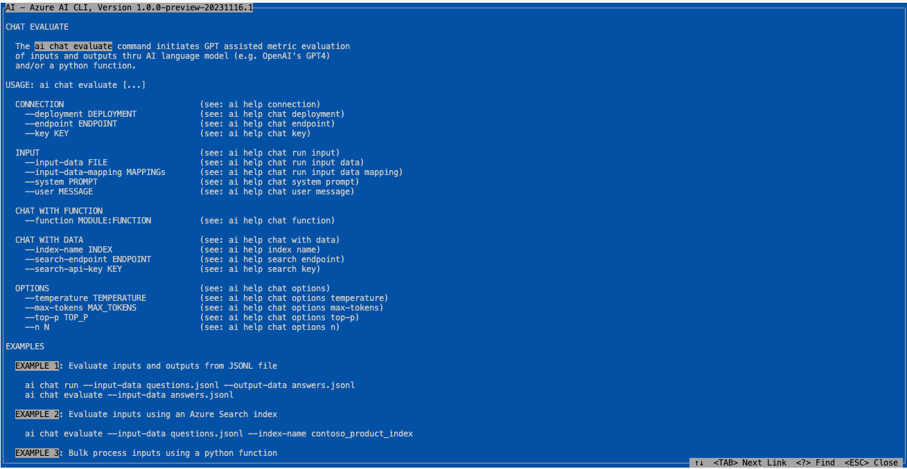
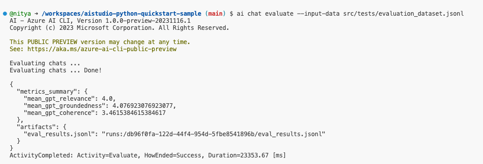
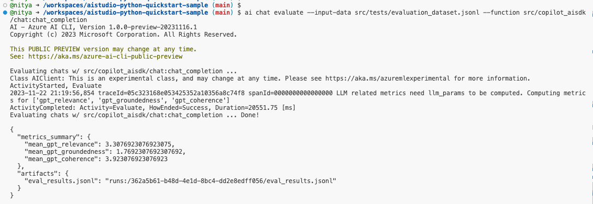
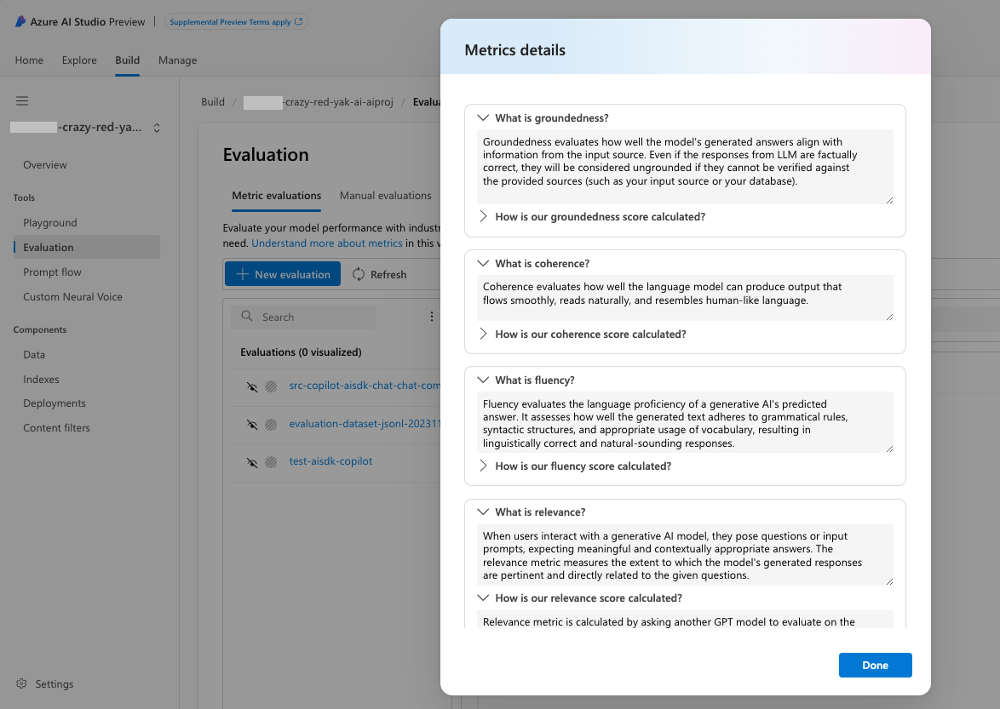
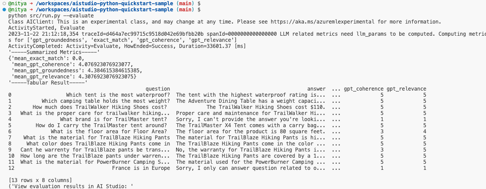
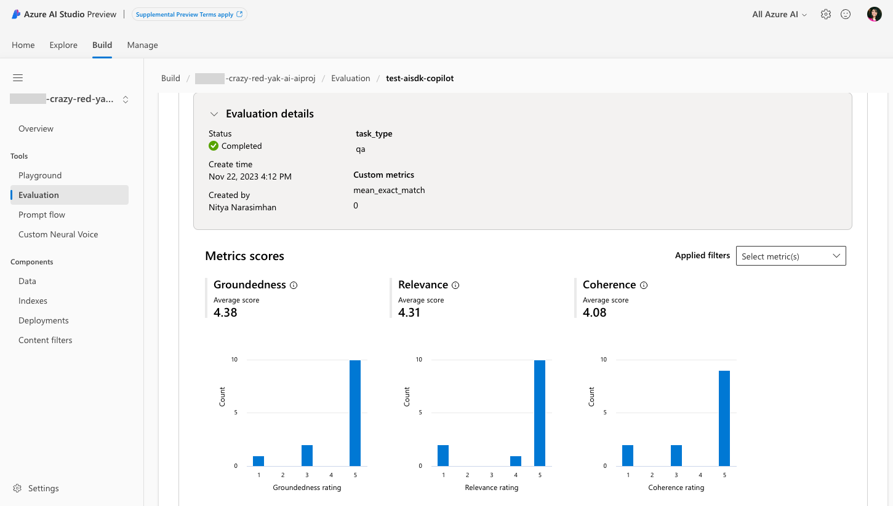

# 07 | Evaluate Your Copilot

## Step 5: Evaluate your copilot implementation

How do we know if our copilot implementation is any good?  We can do this by evaluating our copilot performance with industry standard metrics to compare and choose the best version based on your need

comparing it to other copilot implementations (like `chatgpt`), using a relevant evaluation dataset.

We can evaluate our copilot using the Azure AI CLI or the Azure AI SDK.

### 1. Using Azure AI CLI

The Azure AI CLI provides a `ai chat evaluate` command that you can use for bulk runs and other options as shown.



1. Let's evaluate our "chat with your data" copilot implementation, using `evaluation_dataset.jsonl` as a test dataset. 

    ```bash
    ai chat evaluate --input-data src/tests/evaluation_dataset.jsonl
    ```

    

2. You can also evaluate a "chat with function" copilot implementation, using `evaluation_dataset.jsonl` as a test dataset. 

    ```bash
    ai chat evaluate --input-data src/tests/evaluation_dataset.jsonl --function src/copilot_aisdk/chat:chat_completion
    ```
    

 
You can also revisit evaluation results anytime by visiting Azure AI Studio and navigating to the `Build` tab. Select your AI resource then look for the `Evaluation` section. The snapshot below shows you the metrics available in this view.



### 2. Using Azure AI SDK

To learn how to run an evaluations using the Azure AI SDK, look at the implementation of the `run_evaluation` function definition under `src/run.py`

To execute this code on our default copilot, run the following command:

```
python src/run.py --evaluate
```
The results will be displayed in the console as shown below, which can be hard to parse or recall later.



However, by visiting the Azure AI Studio panel, we can drill down into that specific evaluation run and see the results in a more visual way as shown below:



Take a few minutes to explore the Azure AI Studio interface and see what other metrics and features are available to you.

## Next Steps

🟩 Congratulations! You just learned to evaluate your copilot implementation using the Azure AI CLI and the Azure AI SDK. And you learned where to find the results of your evaluation in Azure AI Studio.

Now it's time to think about how to deploy your copilot implementation to Azure, so that it can be used by your users and applications.

➡️ [**Step 06**: Deploy the copilot to Azure](./step-06.md)