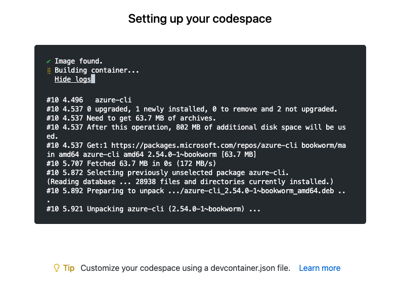
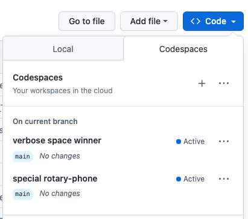
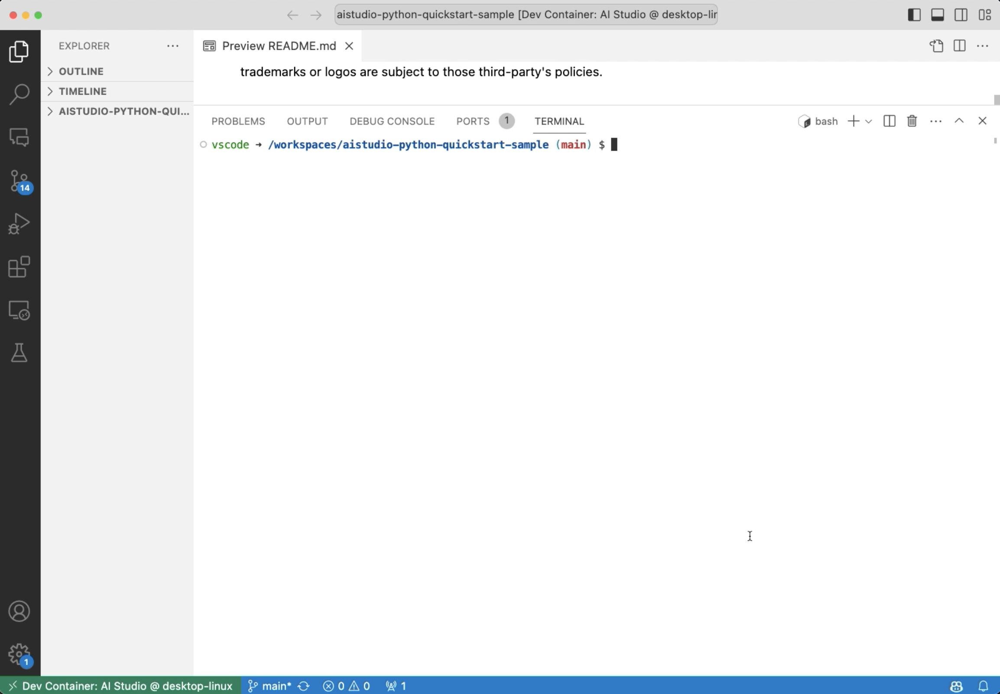
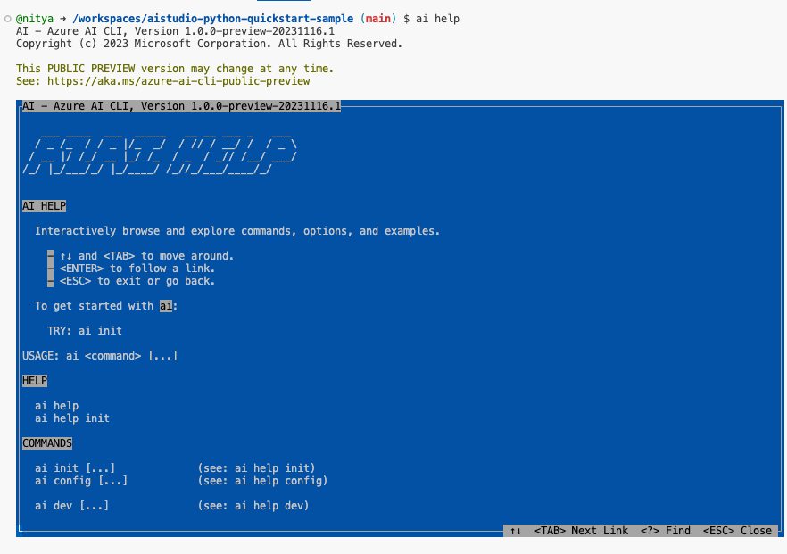

## Step 1: Set up your development environment

Our development environment makes use of 3 resources:
 - [Azure AI Studio](https://aka.ms/azureaistudio) - accessed via browser.
 - [Azure AI CLI](https://learn.microsoft.com/azure/ai-studio/how-to/cli-install?tabs=linux%2Cterminal) - accessed via terminal.
 - [Azure AI SDK](https://learn.microsoft.com/azure/ai-studio/how-to/sdk-install?tabs=linux) - accessed via code.

To setup your development environment, you have 3 options:
1. **Prebuilt, with GitHub Codespaces** -  recommended approach.
2. **Prebuilt, with Docker Desktop** - for local development.
3. **Manually, on local device** - tradeoff complexity for control.

> [!IMPORTANT  
> The Azure AI Studio preview and related Azure AI SDK and Azure AI CLI are likely to evolve quickly to reflect changes and updates. We strongly recommend using the pre-built development environment options to minimize your effort required to setup and maintain your own local environment to be consistent with thesev changes.

For completeness, we've documented all three options below.

---

### Setup-1: Prebuilt, with GitHub Codespaces ✅


> [!NOTE]  
> This is the recommended option. Minimize your setup effort and maximize your productivity by using a prebuilt development environment.

The repository is instrumented to use a [dev container](https://containers.dev) that includes all the necessary tools and packages required to build the copilot. 

1. To get started, click the button below to launch [GitHub Codespaces](https://docs.github.com/codespaces) directly in your browser.

    [](https://github.com/Azure-Samples/aistudio-python-quickstart-sample/)

    Alternatively, you can launch GitHub Codespaces by clicking the "Code" button in the repository UI, selecting the "Codespaces" tab - and then creating a new codespace. _Previously created codespaces will be listed if active or available for resume_.
    
       

2. The first time you launch the codespace, you will see a new tab open with something like this indicating that the Codespace (dev container) is being built. Clicking the `Show Logs` button in the output console will produce the detailed output shown below.

    

3. Once the build completes, you should see the tab refresh to show a Visual Studio Code editor in the browser, as shown below. The blue bar at the bottom left of the screen should show you the name of the running Github Codespaces instance.
    
    

    If you refresh the repository page and view that 'Codespaces' tab again, you should see the same name show up as an active codespace for that repository.
    

    🟩 Congratulations! You're Codespaces is ready!

### Setup-2: Prebuilt, with Docker Desktop

> [!NOTE]  
>  This option is recommended if you prefer to work locally on your device. Continue getting the benefits of a prebuilt development environment using Docker Desktop as your container host.

1. **Install Docker Desktop**. Follow the instructions [here](https://code.visualstudio.com/docs/devcontainers/containers#_installation) to install Docker Desktop on your device.
2. **Clone this repository** to your local device as usual, and open the repository in Visual Studio Code. Then follow the instructions [here](https://code.visualstudio.com/docs/devcontainers/containers#_quick-start-open-an-existing-folder-in-a-container) to open the repository in a dev container hosted in Docker Desktop. It will take a few minutes to build the container, but the end result will look like this. Note that the blue bar at the bottom left of the screen now indicates you are running in a `Dev Container` rather than a named GitHub Codespace.

    

    🟩 Congratulations! You're local Dev Container is ready!


### Setup-3: Manually, for local development

> [!NOTE]  
> This option is provided only for completeness. It is best for advanced users who are willing to tradeoff complexity (in maintenance) for control (in local environment setup). The user is accountable for making related updates when the Azure AI Studio, SDK or CLI dependencies change.

To minimize disruption to other projects on your local device, we recommend using a _managed_ virtual environment (like _venv_ or _conda_) to install the required Python version and dependencies for this project. 

1. **Install and activate a virtual environment**. Follow the guidance in the [How to get started with the Azure AI SDK](https://learn.microsoft.com/azure/ai-studio/how-to/sdk-install?tabs=linux) documentation to install your preferred virtual environment (venv or conda) - and activate it. You need `Python 3.10 or higher` to use the Azure AI SDK.

2. **Install the Azure AI SDK**. Use the `requirements.txt` file in this repo and install dependencies as follows:
    ```bash
    pip install -r requirements.txt
    ```
3. **Install the Azure AI CLI**. Use the following command if your local environment on Ubuntu. To install the CLI on Windows and MacOS, follow the instructions [here](https://github.com/Azure/azureai-insiders/blob/main/previews/aistudio/how-to/use_azureai_sdk.md#install-the-cli) instead.
    ```
    curl -sL https://aka.ms/InstallAzureAICLIDeb | sudo bash
    ```

🟩 Congratulations! You're local environment is ready!

---

### Validate Setup

We assume you've completed one of the three options above to setup your development environment. Now, let's validate the setup by checking if the Azure AI CLI is installed. 

```bash
ai help
```
If setup correctly, you should see the help screen for the Azure AI CLI. as shown below. Hit `Esc` to exit the help screen and get back to your commandline prompt.



🟩 Congratulations! You've validated your dev environment!

## Next Steps

We've setup and validated our development environment. Next, we'll create our Azure AI project and provision resources to build our copilot solution.

➡️ [**Step 02**: Initialize Azure AI Resources](./step-02.md)